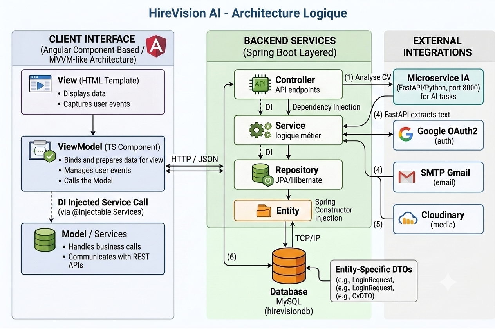
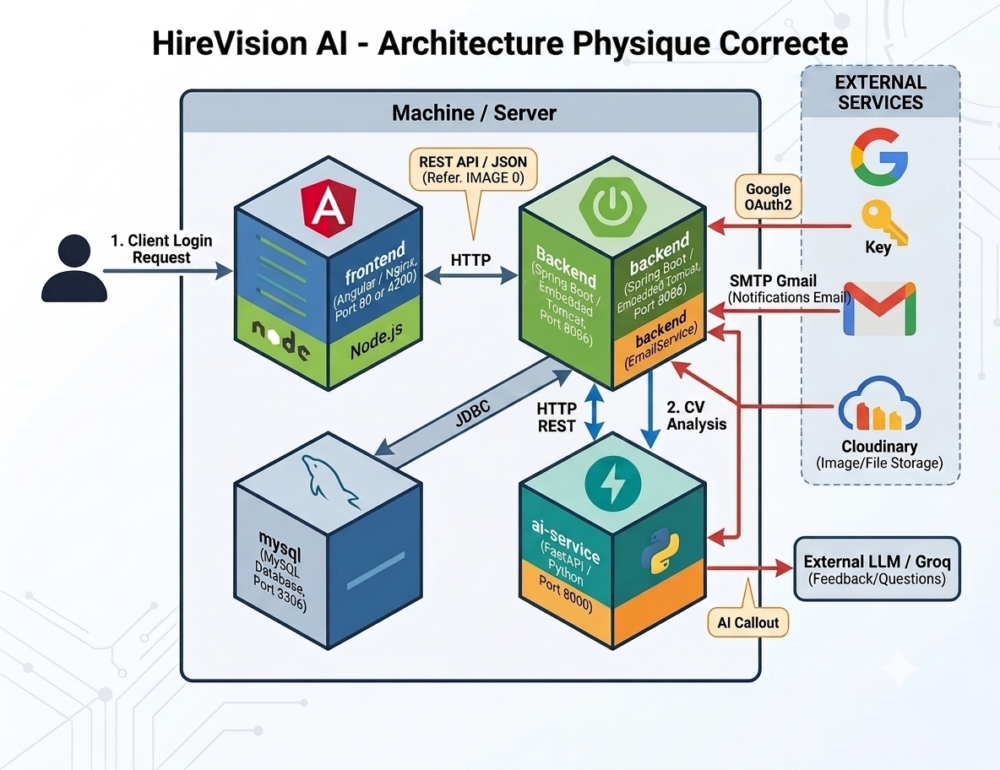

# HireVision AI 🚀

## 📌 Description

**HireVision AI** est une plateforme intelligente de préparation aux entretiens pour développeurs.

Elle permet de faire :

- l’analyse intelligente de CV ;
- le matching entre un candidat et une offre d’emploi ;
- la simulation d’entretien technique ;
- le calcul d’un **Developer Readiness Score** ;
- la génération d’une roadmap personnalisée ;
- l’analyse vocale et comportementale des réponses.

---

## 🏗️ Architecture

HireVision AI repose sur une architecture multi-couches composée d’un frontend Angular, d’un backend Spring Boot, d’une base de données MySQL et d’un microservice IA basé sur FastAPI.

### Architecture logique

<p align="center">
  
</p>

### Architecture physique

<p align="center">
  
</p>

---

## 📁 Structure du projet

HireVision-ai/
│
├── HireVision-ai/                  # Backend Spring Boot
│   ├── src/
│   │   ├── main/
│   │   │   ├── java/com/projet/hirevisionai/
│   │   │   │   ├── Config/
│   │   │   │   ├── Controller/
│   │   │   │   ├── Dto/
│   │   │   │   ├── Entity/
│   │   │   │   ├── Repository/
│   │   │   │   ├── Security/
│   │   │   │   ├── ServiceImpl/
│   │   │   │   ├── ServiceInterface/
│   │   │   │   └── HirevisionAiApplication.java
│   │   │   │
│   │   │   └── resources/
│   │   │       ├── application.properties.example
│   │   │       └── application.properties
│   │   │
│   │   └── test/
│   │
│   ├── pom.xml
│   └── Dockerfile
│
├── HireVision-ai_FrontEnd/          # Frontend Angular
│   ├── src/
│   │   ├── app/
│   │   │   ├── auth/
│   │   │   ├── frontoffice/
│   │   │   ├── backoffice/
│   │   │   ├── guards/
│   │   │   └── services/
│   │   ├── assets/
│   │   ├── main.ts
│   │   └── styles.css
│   │
│   ├── angular.json
│   ├── package.json
│   ├── tsconfig.json
│   └── Dockerfile
│
├── ai-service/                      # Microservice IA FastAPI
│   ├── main.py
│   ├── extractor.py
│   ├── ml_model.py
│   ├── job_matcher.py
│   ├── interview_analyzer.py
│   ├── question_generator.py
│   ├── llm_client.py
│   ├── embeddings.py
│   ├── train_model.py
│   ├── clean_dataset.py
│   ├── dataset.csv
│   ├── dataset_clean.csv
│   ├── model.joblib
│   ├── requirements.txt
│   └── Dockerfile
│
├── docs/
│   └── images/
│       ├── architecture-logique.png
│       └── architecture-physique.png
│
├── docker-compose.yml
├── .env.example
└── README.md

### Dossiers principaux

- `HireVision-ai/` : contient l’API REST Spring Boot, les controllers, services, repositories, entités, DTOs et la configuration de sécurité.
- `HireVision-ai_FrontEnd/` : contient l’application Angular avec les modules d’authentification, frontoffice, backoffice, guards et services.
- `ai-service/` : contient le microservice IA FastAPI responsable de l’analyse CV, du matching emploi, des questions d’entretien et du feedback.
- `docs/images/` : contient les schémas d’architecture utilisés dans le README.

---

## ✨ Fonctionnalités

### Candidat

- 📄 **Analyse CV IA** : extraction de compétences, détection du profil, score global et recommandations d’optimisation.
- 🎯 **Job Matching** : calcul de compatibilité entre le CV du candidat et les offres d’emploi.
- 🎤 **Simulation d’entretien** : questions adaptatives par spécialité avec analyse des réponses.
- 📊 **Developer Readiness Score** : score multi-axe : Backend, Frontend, Database, DevOps, Soft Skills et Interview.
- 🗺️ **Roadmap personnalisée** : plan de carrière hebdomadaire basé sur les lacunes détectées.
- 🏅 **Gamification** : badges, progression et suivi de performance.
- 🌙 **Dark Mode** : mode sombre mémorisé.
- 🌐 **Multilingue** : français, anglais et arabe.

### Administrateur

- Dashboard analytics.
- Gestion des utilisateurs.
- Gestion des offres d’emploi.
- Gestion des questions d’entretien.
- Gestion des abonnements.
- Gestion des paramètres de la plateforme.

---

## 🛠️ Technologies utilisées

### Frontend

- Angular 16
- TypeScript
- HTML5 / CSS3
- RxJS
- Chart.js
- CoreUI
- ngx-translate

### Backend

- Java 17
- Spring Boot
- Spring Security
- JWT
- Spring Data JPA
- Hibernate
- Maven
- Swagger / SpringDoc OpenAPI

### IA / Machine Learning

- Python
- FastAPI
- pdfplumber
- OpenCV
- NumPy
- Joblib
- Groq / LLM API

### Base de données et services externes

- MySQL
- Google OAuth2
- SMTP Gmail
- Cloudinary

### DevOps

- Docker
- Docker Compose
- Nginx

---

## 🚀 Démarrage rapide avec Docker

### 1. Cloner le projet
git clone https://github.com/safa-hmd/HireVision-ai.git
cd HireVision-ai

### 2. Configurer les variables d’environnement
cp .env.example .env

Puis remplir les valeurs nécessaires dans `.env` :

​
GROQ_API_KEY=your_groq_api_key
JWT_SECRET=your_jwt_secret
GOOGLE_CLIENT_ID=your_google_client_id
GOOGLE_CLIENT_SECRET=your_google_client_secret
MAIL_USERNAME=your_email
MAIL_PASSWORD=your_app_password

### 3. Démarrer tous les services
docker compose up --build

### Services accessibles

| Service | URL |
|---|---|
| Frontend | `http://localhost:4200` |
| Backend | `http://localhost:8086/HireVision` |
| Swagger Backend | `http://localhost:8086/HireVision/swagger-ui.html` |
| AI Service Docs | `http://localhost:8000/docs` |

---

## Prérequis pour le développement local

Si tu veux exécuter le projet sans Docker, tu dois installer :

- Java 17 ou plus ;
- Maven ;
- Node.js 18 ou plus ;
- npm ;
- Python 3.10 ou plus ;
- MySQL 8.0.

---

## Installation locale

### 1. Backend Spring Boot

​
cd HireVision-ai
cp src/main/resources/application.properties.example src/main/resources/application.properties

Configurer le fichier 
src/main/resources/application.properties

Puis lancer le backend :
./mvnw spring-boot:run

Sur Windows :
mvnw.cmd spring-boot:run

Le backend démarre sur :
http://localhost:8086/HireVision

Swagger UI :
http://localhost:8086/HireVision/swagger-ui.html

---

### 2. Service IA FastAPI

​
cd ai-service
python -m venv venv

Sur Windows :
venvScriptsactivate

Sur Linux / macOS :
source venv/bin/activate

Installer les dépendances :
pip install -r requirements.txt

Créer le fichier `.env` :
cp .env.example .env

Puis renseigner la clé :
GROQ_API_KEY=your_groq_api_key

Lancer le service IA :
uvicorn main:app --host 0.0.0.0 --port 8000 --reload

Le service IA démarre sur :
http://localhost:8000

Documentation interactive :
http://localhost:8000/docs

---

### 3. Frontend Angular

​
cd HireVision-ai_FrontEnd
npm install
npm start

Le frontend démarre sur :
http://localhost:4200

---

## 🔒 Sécurité

- Les secrets sensibles sont externalisés via des variables d’environnement.
- Les fichiers `.env` et `application.properties` contenant des valeurs réelles ne doivent jamais être commités.
- Les fichiers sensibles doivent être ajoutés dans `.gitignore`.
- Les endpoints protégés exigent un JWT valide.
- Les endpoints liés au CV et au matching vérifient la propriété des ressources.
- Le service IA applique une configuration CORS restreinte.

---

## 🐳 Docker

Chaque service possède son propre `Dockerfile`.

| Fichier | Service |
|---|---|
| `HireVision-ai/Dockerfile` | Backend Spring Boot |
| `HireVision-ai_FrontEnd/Dockerfile` | Frontend Angular + Nginx |
| `ai-service/Dockerfile` | Service IA FastAPI |
| `docker-compose.yml` | Orchestration complète |

```bash
docker compose up --build    # Premier démarrage
docker compose up -d         # Mode daemon (arrière-plan)
docker compose down          # Arrêter et supprimer les conteneurs
docker compose down -v       # + Supprimer les volumes (réinitialise la DB)
```

---

## 📚 API Documentation

| URL | Description |
|---|---|
| `http://localhost:8086/HireVision/swagger-ui.html` | Swagger UI Backend |
| `http://localhost:8000/docs` | Swagger UI FastAPI |
| `http://localhost:8086/HireVision/actuator/health` | Health Check Backend |
| `http://localhost:8000/health` | Health Check AI Service |

---

## 👤 Auteur

**Safa Hamdi**

GitHub : [safa-hmd](https://github.com/safa-hmd)

---

## 📄 Licence

© 2026 HireVision AI — Tous droits réservés.