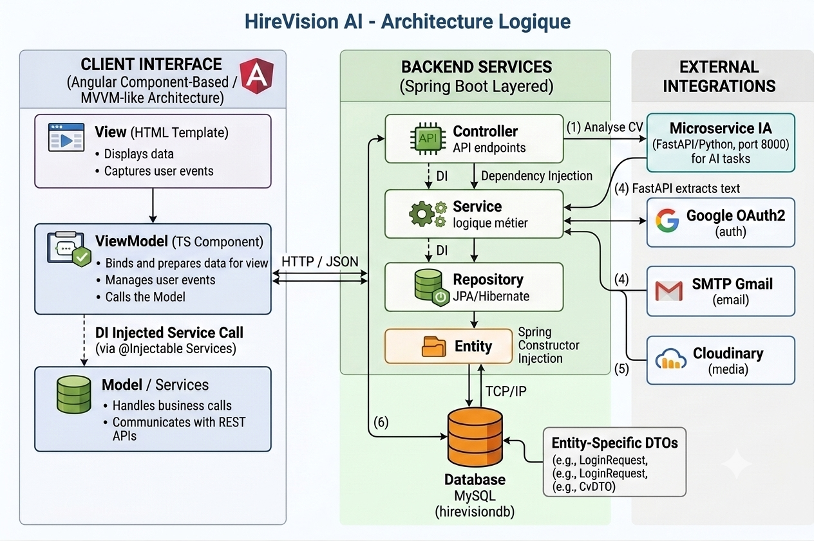
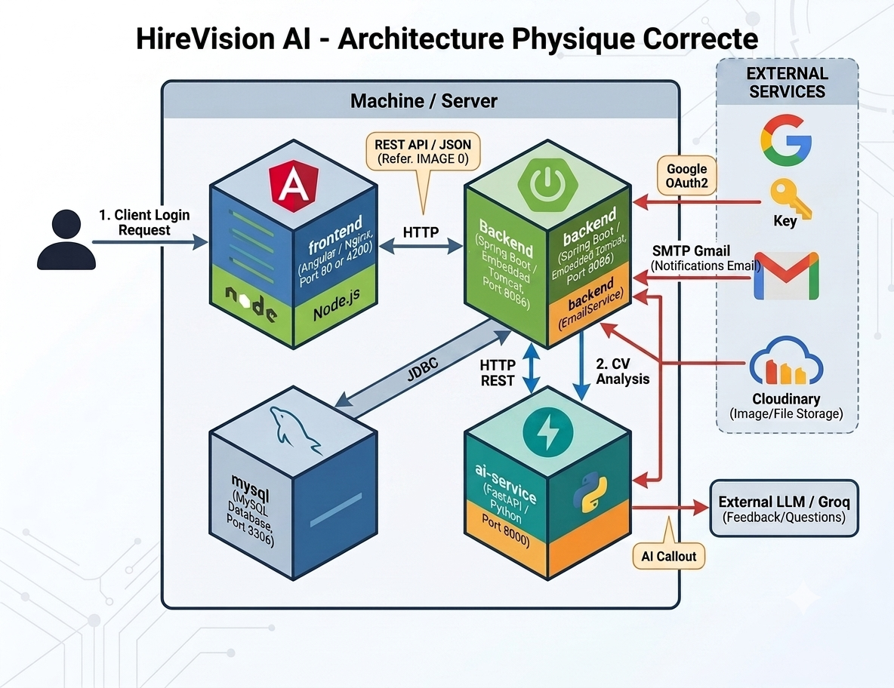

# HireVision AI 🚀

[](https://github.com/safa-hmd/HireVision-ai/actions/workflows/ci.yml)
[](https://github.com/safa-hmd/HireVision-ai/actions/workflows/cd.yml)


## 📌 Description

**HireVision AI** est une plateforme intelligente de préparation aux entretiens pour développeurs.

Elle permet de faire :

- l'analyse intelligente de CV ;
- le matching entre un candidat et une offre d'emploi ;
- la simulation d'entretien technique ;
- le calcul d'un **Developer Readiness Score** ;
- la génération d'une roadmap personnalisée ;
- l'analyse vocale et comportementale des réponses.

🔗 **Démo en ligne** : [hirevision-frontend.gentlebay-58ff12f9.swedencentral.azurecontainerapps.io](https://hirevision-frontend.gentlebay-58ff12f9.swedencentral.azurecontainerapps.io/frontoffice/home)

---

## 🏗️ Architecture

HireVision AI repose sur une architecture multi-couches composée d'un frontend Angular, d'un backend Spring Boot, d'une base de données MySQL et d'un microservice IA basé sur FastAPI.

### Architecture logique

<p align="center">
  
</p>

### Architecture physique

<p align="center">
  
</p>

---

## 📁 Structure du projet

```
HireVision-ai/
│
├── HireVision-ai/                  # Backend Spring Boot
│   ├── src/
│   │   ├── main/
│   │   │   ├── java/com/projet/hirevisionai/
│   │   │   │   ├── Config/
│   │   │   │   ├── Controller/
│   │   │   │   ├── Dto/
│   │   │   │   ├── Entity/
│   │   │   │   ├── Repository/
│   │   │   │   ├── Security/
│   │   │   │   ├── ServiceImpl/
│   │   │   │   ├── ServiceInterface/
│   │   │   │   └── HirevisionAiApplication.java
│   │   │   │
│   │   │   └── resources/
│   │   │       ├── application.properties.example
│   │   │       └── application.properties
│   │   │
│   │   └── test/                   # Tests unitaires + intégration (JUnit5, Mockito, H2)
│   │
│   ├── pom.xml
│   └── Dockerfile
│
├── HireVision-ai_FrontEnd/          # Frontend Angular
│   ├── src/
│   │   ├── app/
│   │   │   ├── auth/
│   │   │   ├── frontoffice/
│   │   │   ├── backoffice/
│   │   │   ├── guards/
│   │   │   ├── interceptors/
│   │   │   └── services/
│   │   ├── environments/            # environment.ts / environment.prod.ts
│   │   ├── assets/
│   │   ├── main.ts
│   │   └── styles.css
│   │
│   ├── angular.json
│   ├── package.json
│   ├── tsconfig.json
│   └── Dockerfile
│
├── ai-service/                      # Microservice IA FastAPI
│   ├── main.py
│   ├── extractor.py
│   ├── ml_model.py
│   ├── job_matcher.py
│   ├── interview_analyzer.py
│   ├── question_generator.py
│   ├── llm_client.py
│   ├── embeddings.py
│   ├── train_model.py
│   ├── clean_dataset.py
│   ├── dataset.csv
│   ├── dataset_clean.csv
│   ├── model.joblib
│   ├── tests/                       # Suite pytest
│   ├── requirements.txt
│   └── Dockerfile
│
├── docs/
│   └── images/
│       ├── architecture-logique.png
│       └── architecture-physique.png
│
├── docker-compose.yml
├── .env.example
└── README.md
```

### Dossiers principaux

- `HireVision-ai/` : contient l'API REST Spring Boot, les controllers, services, repositories, entités, DTOs et la configuration de sécurité.
- `HireVision-ai_FrontEnd/` : contient l'application Angular avec les modules d'authentification, frontoffice, backoffice, guards et services.
- `ai-service/` : contient le microservice IA FastAPI responsable de l'analyse CV, du matching emploi, des questions d'entretien et du feedback.
- `docs/images/` : contient les schémas d'architecture utilisés dans le README.

---

## ✨ Fonctionnalités

### Candidat

- 📄 **Analyse CV IA** : extraction de compétences, détection du profil, score global et recommandations d'optimisation.
- 🎯 **Job Matching** : calcul de compatibilité entre le CV du candidat et les offres d'emploi.
- 🎤 **Simulation d'entretien** : questions adaptatives par spécialité avec analyse des réponses.
- 📊 **Developer Readiness Score** : score multi-axe : Backend, Frontend, Database, DevOps, Soft Skills et Interview.
- 🗺️ **Roadmap personnalisée** : plan de carrière hebdomadaire basé sur les lacunes détectées.
- 🏅 **Gamification** : badges, progression et suivi de performance.
- 🌙 **Dark Mode** : mode sombre mémorisé.
- 🌐 **Multilingue** : français, anglais et arabe (RTL).

### Administrateur

- Dashboard analytics.
- Gestion des utilisateurs.
- Gestion des offres d'emploi.
- Gestion des questions d'entretien.
- Gestion des abonnements.
- Gestion des paramètres de la plateforme.

---

## 🛠️ Technologies utilisées

### Frontend

- Angular 17
- TypeScript
- HTML5 / CSS3
- RxJS
- Chart.js
- CoreUI
- ngx-translate

### Backend

- Java 17
- Spring Boot
- Spring Security
- JWT
- Spring Data JPA
- Hibernate
- Maven
- Swagger / SpringDoc OpenAPI

### IA / Machine Learning

- Python
- FastAPI
- sentence-transformers (`paraphrase-multilingual-MiniLM-L12-v2`)
- pdfplumber
- OpenCV
- NumPy
- Joblib
- Groq / LLM API

### Base de données et services externes

- MySQL
- Google OAuth2
- SMTP Gmail
- Cloudinary

### DevOps

- Docker / Docker Compose
- Nginx
- GitHub Actions (CI/CD)
- Docker Hub
- Azure Container Apps
- Azure Database for MySQL

---

## ✅ Tests

Le projet est couvert par une suite de tests sur les trois couches :

| Couche | Outils | Couverture |
|---|---|---|
| Backend | JUnit5, Mockito, H2 (in-memory) | Tests unitaires des services, tests d'intégration (`AbstractIntegrationTest`), tests des controllers (auth, user, CV, offres, sécurité) |
| Frontend | Jasmine / Karma | 19 fichiers `spec.ts` couvrant services, guards, interceptors et pipes |
| Service IA | pytest | Job matching, modèle ML, extraction CV, génération de questions, client LLM, analyse GitHub |

```bash
# Backend
cd HireVision-ai
./mvnw test

# Frontend
cd HireVision-ai_FrontEnd
npm test

# Service IA
cd ai-service
pytest
```

---

## 🚀 Démarrage rapide avec Docker

### 1. Cloner le projet
```bash
git clone https://github.com/safa-hmd/HireVision-ai.git
cd HireVision-ai
```

### 2. Configurer les variables d'environnement
```bash
cp .env.example .env
```

Puis remplir les valeurs nécessaires dans `.env` :

```
GROQ_API_KEY=your_groq_api_key
JWT_SECRET=your_jwt_secret
GOOGLE_CLIENT_ID=your_google_client_id
GOOGLE_CLIENT_SECRET=your_google_client_secret
MAIL_USERNAME=your_email
MAIL_PASSWORD=your_app_password
```

### 3. Démarrer tous les services
```bash
docker compose up --build
```

### Services accessibles

| Service | URL |
|---|---|
| Frontend | `http://localhost:4200` |
| Backend | `http://localhost:8086/HireVision` |
| Swagger Backend | `http://localhost:8086/HireVision/swagger-ui.html` |
| AI Service Docs | `http://localhost:8000/docs` |

---

## Prérequis pour le développement local

Si tu veux exécuter le projet sans Docker, tu dois installer :

- Java 17 ou plus ;
- Maven ;
- Node.js 18 ou plus ;
- npm ;
- Python 3.10 ou plus ;
- MySQL 8.0.

---

## Installation locale

### 1. Backend Spring Boot

```bash
cd HireVision-ai
cp src/main/resources/application.properties.example src/main/resources/application.properties
```

Configurer le fichier `src/main/resources/application.properties`, puis lancer le backend :

```bash
./mvnw spring-boot:run
```

Sur Windows :
```powershell
mvnw.cmd spring-boot:run
```

Le backend démarre sur : `http://localhost:8086/HireVision`
Swagger UI : `http://localhost:8086/HireVision/swagger-ui.html`

---

### 2. Service IA FastAPI

```bash
cd ai-service
python -m venv venv
```

Sur Windows :
```powershell
venv\Scripts\activate
```

Sur Linux / macOS :
```bash
source venv/bin/activate
```

Installer les dépendances :
```bash
pip install -r requirements.txt
```

Créer le fichier `.env` :
```bash
cp .env.example .env
```

Puis renseigner la clé :
```
GROQ_API_KEY=your_groq_api_key
```

Lancer le service IA :
```bash
uvicorn main:app --host 0.0.0.0 --port 8000 --reload
```

Le service IA démarre sur : `http://localhost:8000`
Documentation interactive : `http://localhost:8000/docs`

---

### 3. Frontend Angular

```bash
cd HireVision-ai_FrontEnd
npm install
npm start
```

Le frontend démarre sur : `http://localhost:4200`

---

## 🔒 Sécurité

- Les secrets sensibles sont externalisés via des variables d'environnement.
- Les fichiers `.env` et `application.properties` contenant des valeurs réelles ne doivent jamais être commités.
- Les fichiers sensibles doivent être ajoutés dans `.gitignore`.
- Les endpoints protégés exigent un JWT valide.
- Les endpoints liés au CV et au matching vérifient la propriété des ressources (ownership).
- Le service IA applique une configuration CORS restreinte.

---

## 🐳 Docker

Chaque service possède son propre `Dockerfile`.

| Fichier | Service |
|---|---|
| `HireVision-ai/Dockerfile` | Backend Spring Boot |
| `HireVision-ai_FrontEnd/Dockerfile` | Frontend Angular + Nginx |
| `ai-service/Dockerfile` | Service IA FastAPI |
| `docker-compose.yml` | Orchestration complète |

```bash
docker compose up --build    # Premier démarrage
docker compose up -d         # Mode daemon (arrière-plan)
docker compose down          # Arrêter et supprimer les conteneurs
docker compose down -v       # + Supprimer les volumes (réinitialise la DB)
```

---

## 🔄 CI/CD

Le projet utilise **GitHub Actions** pour l'intégration et la livraison continues.

### Pipeline CI

Déclenché automatiquement à chaque `push` et `pull request` :

- Build du backend avec Maven
- Build du frontend avec npm et Angular CLI
- Build des images Docker via Docker Compose

### Pipeline CD

Déclenché après le succès du pipeline CI :

- Connexion à Docker Hub via les secrets GitHub
- Build des images Docker
- Push des images vers Docker Hub

### Secrets GitHub requis

```
DOCKERHUB_USERNAME
DOCKERHUB_TOKEN
```

### Images Docker Hub

```
safahmd/hirevision-backend:latest
safahmd/hirevision-frontend:latest
safahmd/hirevision-ai-service:latest
```

---

## ☁️ Déploiement Azure

L'application est déployée en production sur **Azure Container Apps**, avec une base de données **Azure Database for MySQL**.

### Ressources Azure

| Container App | Rôle | Région |
|---|---|---|
| `hirevision-frontend` | Angular + Nginx | Sweden Central |
| `hirevision-backend` | API Spring Boot | Sweden Central |
| `hirevision-ai-service` | Microservice FastAPI | Sweden Central |
| `hirevision-mysql` | Base de données | Sweden Central |

- **Resource Group** : `hirevision-rg-swe`
- **Container Apps Environment** : `managedEnvironment-hirevision...`
- **Registre de conteneurs** : Docker Hub

### URL de production

Frontend :
```
https://hirevision-frontend.gentlebay-58ff12f9.swedencentral.azurecontainerapps.io/frontoffice/home
```

### Architecture de déploiement

```
GitHub Repository
        │
        ▼
GitHub Actions CI/CD
        │
        ▼
    Docker Hub
        │
        ▼
Azure Container Apps
        │
        ├── Frontend Container
        ├── Backend Container
        └── AI Service Container
        │
        ▼
Azure Database for MySQL
```

### Points d'attention lors du déploiement Azure

- Les URLs `localhost` codées en dur dans les services Angular doivent être remplacées par des variables d'environnement (`environment.ts` / `environment.prod.ts` + `fileReplacements` dans `angular.json`).
- Le `Dockerfile` du frontend ne doit pas référencer de `proxy_pass` pointant vers un hostname Docker Compose (invalide sur Azure) ; Nginx doit appeler directement l'URL publique du backend.
- Les variables `SPRING_DATASOURCE_URL`, `AI_SERVICE_URL` et `FRONTEND_URL` doivent être configurées comme variables d'environnement de chaque Container App plutôt que codées en dur.

---

## 📚 API Documentation

| URL | Description |
|---|---|
| `http://localhost:8086/HireVision/swagger-ui.html` | Swagger UI Backend |
| `http://localhost:8000/docs` | Swagger UI FastAPI |
| `http://localhost:8086/HireVision/actuator/health` | Health Check Backend |
| `http://localhost:8000/health` | Health Check AI Service |

---

## 🖼️ Captures d'écran

*(à ajouter)*

- Page d'accueil
- Analyse de CV
- Job matching
- Préparation d'entretien
- Session d'entretien IA
- Pipeline GitHub Actions
- Container Apps sur Azure

---

## ⚠️ Défis rencontrés

- Timeout de build Docker lors de l'installation des dépendances Python.
- Taille importante de l'image du service IA (dépendances ML).
- Gestion des URLs `localhost` codées en dur lors du passage au déploiement cloud.
- Blocage des endpoints de health check par Spring Security.
- Récursion infinie JSON causée par les relations bidirectionnelles JPA.
- Déploiement multi-services avec Azure Container Apps.

## 🔭 Améliorations futures

- Optimiser la taille de l'image Docker du service IA.
- Ajouter le monitoring et les logs sur Azure.
- Automatiser le déploiement Docker Hub → Azure.
- Améliorer le feedback des entretiens IA.
- Renforcer la configuration de sécurité pour la production.

---

## 👤 Auteur

**Safa Hamdi**

Étudiante ingénieure à ESPRIT.

GitHub : [safa-hmd](https://github.com/safa-hmd)

---

## 📄 Licence

© 2026 HireVision AI — Tous droits réservés.
